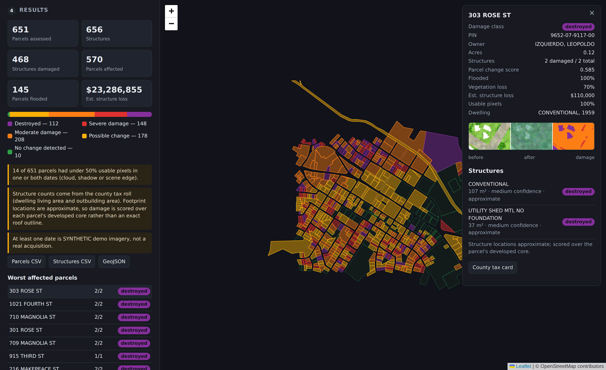

# Parcel-based disaster damage assessment

A web app that compares a **before** and **after** satellite image over a
county parcel layer and reports, parcel by parcel, how many structures were
damaged.

Pick an area on the map — draw a box or click parcels — choose a date either
side of the event, and the app fetches the imagery, detects change, and rolls
it up to a table you can hand to an emergency manager: PIN, address, owner,
structures damaged, flooded fraction, estimated loss.

Built around **Lee County, North Carolina** (35,409 parcels), but the ingest
takes any county parcel shapefile.



## Quick start

```bash
make install                        # venv + dependencies
make ingest PARCELS=Parcels.zip     # load the county parcel layer (~30 s)
make serve                          # http://127.0.0.1:8000
```

Then in the browser:

1. **Choose an area** — click *Draw a box* and drag over a neighbourhood, or
   *Click parcels* to pick individual lots. Zoom to 15 or closer to see parcels.
2. **Pick imagery** — the source dropdown defaults to the built-in **demo**
   provider, which generates synthetic before/after imagery over the real
   parcel fabric with no network access. The date pickers pre-fill either side
   of its simulated 18 Sep 2025 event. Click *Find imagery*.
3. **Assess damage** — results colour the map, fill a summary panel, and
   download as CSV or GeoJSON. Click any parcel for a before / after / damage
   image strip and a per-structure breakdown.

Everything above works offline. To use real satellite imagery, pick
*Sentinel-2 L2A* in the source dropdown (free, no account) or register your own
imagery — see [docs/IMAGERY.md](docs/IMAGERY.md).

## What it actually does

```
parcels ──► pick AOI ──► pre + post scene ──► analysis grid
                                                  │
   co-register ──► radiometric match ──► change measures ──► damage score
                                                  │
                             zonal stats over structures and parcels
                                                  │
                                   map · table · CSV · GeoJSON · rasters
```

The detector is explainable rather than learned: spectral change magnitude,
structural similarity loss, NDVI and NDWI deltas, combined into a score with
change on formerly-vegetated pixels discounted so storm defoliation does not
read as building damage. Full method, including why each step is there:
[docs/METHOD.md](docs/METHOD.md).

Structure counts come from the county tax roll, which records dwelling living
area and outbuilding area for 21,890 of the 35,409 parcels. Lee County
publishes no footprint geometry, so those structures are counted honestly but
located approximately, and the app says so everywhere it matters — see
*Approximate footprints* below.

## Read this before trusting a number

- **Resolution decides what is claimable.** At Sentinel-2's 10 m a
  single-family roof is one to two pixels. Flood extent, defoliation and
  neighbourhood-scale destruction are credible; per-roof grading is not. For
  structure-level answers use sub-metre imagery — NAIP for the before date,
  Maxar Open Data for the after date, both free.
- **Demo imagery is synthetic.** It is generated locally to exercise the
  workflow. Scenes are labelled `SYNTHETIC` in the picker and every result
  built from one carries a warning.
- **The thresholds are calibrated on that synthetic data.** They separate
  damaged from intact in the simulation (F1 ≈ 0.82 for major-or-destroyed).
  That validates the plumbing, not the physics. Re-calibrate against real
  labelled imagery before operational use — `scripts/calibrate.py` is built
  for exactly that.
- **Nadir imagery misses a lot.** Intact roof over destroyed walls reads as
  undamaged, and so does most flood damage below the roofline.
- **The loss figure is a triage aid**, appraised building value apportioned by
  damage class, not an appraisal.

## Approximate footprints

Damage is scored differently depending on what footprint data exists:

| Footprint source | How a structure is scored | Confidence ceiling |
|---|---|---|
| Footprint file / OpenStreetMap | 75th percentile of the roof's own pixels | high |
| County tax roll (default here) | Strongest structure-sized patch of change within the parcel's developed core | medium |

With tax-roll footprints the app knows *how many* structures a parcel holds
and roughly how big they are, but not where they sit. Rather than score a
guessed rectangle, it looks for a building-sized patch of change anywhere in
the built-up part of the lot. Every such result is flagged `approximate`, and
all structures on the parcel share the parcel's answer.

Supplying real footprints upgrades this automatically:

```bash
export DDX_BUILDING_FILE=/data/nc_building_footprints.geojson
make serve
```

Microsoft Building Footprints for North Carolina works, as does any county
structures layer or OSM extract.

## Layout

```
ddx/
  geo.py          CRS, bboxes, analysis grids
  parcels.py      SQLite + R-tree parcel store
  imagery/        provider interface, demo/local/STAC providers, COG reads
    synth.py      procedural pre/post scene renderer (the demo)
  buildings/      tax-roll, vector file and OSM footprint sources
  change.py       co-registration, normalisation, change measures, scoring
  zonal.py        grouped statistics over a label raster
  assess.py       structure and parcel roll-up
  pipeline.py     end-to-end run
  jobs.py         background job registry
  api.py          FastAPI endpoints + static hosting
  export.py       CSV exports
  render.py       PNG chips and damage overlays
frontend/         Leaflet UI, no build step, Leaflet vendored for offline use
scripts/
  ingest_parcels.py   shapefile -> parcel database
  register_scene.py   add your own imagery as a selectable date
  calibrate.py        score the detector against the demo ground truth
tests/            111 tests; `-m "not slow"` skips the end-to-end runs
```

## API

| Endpoint | Purpose |
|---|---|
| `GET /api/health` | Dataset, extent, limits, damage classes |
| `GET /api/parcels?bbox=w,s,e,n` | Parcels as GeoJSON |
| `GET /api/parcels/search?q=` | Address / owner / PIN lookup |
| `GET /api/imagery/providers` | Selectable imagery sources |
| `GET /api/imagery/scenes?bbox=&start=&end=` | Available scenes in a window |
| `POST /api/assess` | Submit a job → `{id, status}` |
| `GET /api/assess/{id}` | Progress and summary |
| `GET /api/assess/{id}/parcels.geojson` | Full results |
| `GET /api/assess/{id}/parcels.csv` | Parcel damage table |
| `GET /api/assess/{id}/buildings.csv` | One row per structure |
| `GET /api/assess/{id}/chip/{parcel}.png` | Before / after / damage strip |
| `GET /api/assess/{id}/raster/score.tif` | Georeferenced damage raster |

Interactive docs at `/docs` when the server is running.

## Configuration

All optional; every value has a working default.

| Variable | Default | Purpose |
|---|---|---|
| `DDX_DATA_DIR` | `./data` | Database, jobs, scenes, cache |
| `DDX_IMAGERY_PROVIDERS` | `local,demo,earth-search:sentinel-2-l2a` | Sources offered |
| `DDX_BUILDING_FILE` | — | Footprint file; upgrades every result off approximations |
| `DDX_BUILDING_SOURCE` | `auto` | `auto`, `tax-roll`, `file`, `osm` |
| `DDX_MAX_AOI_KM2` | `150` | Largest area one job may cover |
| `DDX_MAX_PARCELS_PER_JOB` | `5000` | Parcel ceiling per job |
| `DDX_MAX_ANALYSIS_PIXELS` | `12000000` | Pixel budget; grid coarsens to fit |
| `DDX_ANALYSIS_GSD` | `2.0` | Fallback resolution when a scene declares none |

## Testing

```bash
make test          # 111 tests, ~7 s
make test-fast     # skips the four end-to-end runs
make calibrate     # detector vs. the demo's ground truth, with a threshold sweep
```

`make calibrate` prints a confusion matrix against the simulation's known
damage states and sweeps the damaged-vs-not threshold. It is the harness to
point at real labelled imagery when you have some.

## Next steps toward production

1. **Calibrate on a real event.** Pair xBD or field-verified inspections with
   the imagery and re-tune `DetectorConfig` in `ddx/change.py`.
2. **Get real footprints.** The single largest accuracy gain available; it
   moves every structure from approximate to exact sampling.
3. **Add SAR.** Sentinel-1 sees through cloud, which optical cannot, and the
   first usable optical scene after a hurricane is often days late.
4. **Persist jobs properly.** Results currently live on disk per job with the
   last few kept in memory; a real deployment wants a database and auth.
